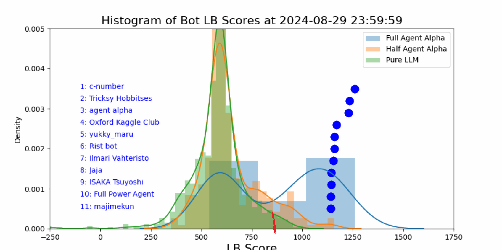

# Kaggle - 20 Questions competition - 100% fine-tuning-based approach

This is a solution to [20 Questions](https://www.kaggle.com/competitions/llm-20-questions) Kaggle competition.
In this competition intellectual agents compete in 20 Questions game - for each game a keyword is chosen.
One agent has to ask 20 yes-or-no questions one by one, trying to guess the keyword at each iteration.
Another agent has to answer those yes-or-no question (given that it know the hidden keyword, of course).

## Approach 
It was clear that the most successful approach for the competition was binary search over a pre-defined vocabulary.
20 questions allow you to sift through over 2**20 ~= 1 million words (while English vocabulary only contains around 250k words).

However, I took a more anthropomorphic approach - I've tried to actually train an LLM to get better at the game without 
relying on being able to perfectly lexicographically compare string (which neither human nor LLM are capable of).

This competition provided limited computing resources, so only models with ~8B parameters could be used.
Hence, my idea was to distill knowledge from a much larger language model (GPT-4o in this case).
Turns out that GPT-4o is able to get ~50-60% winrate at the game (while average LLM solutions on Kaggle reported ~10-20% winrate).

## Training data generation (knowledge distillation)
I've applied several strategies to generate data:
- Just plain and simple game simulation - GPT-4o asks a question, then answers it, and then takes a guess,
until it gets it right or runs out of turns. The aim is to give LLM general understanding of how to play the game during fine-tuning.
- Game simulation + keyword hints after certain iteration. After certain iteration, I add another piece to the prompt, which
reveals the keyword to the LLM, but asks it to act as if it doesn't know it and try to keep asking until the correct keyword
becomes obvious. The goal here is to provide higher-quality data with insightful questions, and make GPT-4o perform better
than its actual capabilities.
- Perfect games snapshots - GPT-4o generates a final winning game state (all of the questions-answers-guesses) and then this
data is used for fine-tuning. The goal here is mainly to optimize costs, since full simulations are pretty pricey.
- When GPT-4o-mini got released I've also employed it to run basic game simulations on all the keywords from training set.

### Data
Training data after preprocessing is available [here](https://drive.google.com/file/d/1rY6M8dsvMq0GCp06SxfbJXxnd5Q1fAZd/view?usp=sharing). The data is stored as pickled Pydantic models, so `data_collection/models.py` is necessary to be able to open it.

## Supervised fine-tuning
I've used Llama 3 8B Instruct model (and Llama 3.1 8B instruct after it got released) as my base model to be fine-tuned.

I've also considered using InternLM2.5-7b-chat model because they've announced superior results on math and reasoning-related benchmarks. However, 
I wasn't satisfied with how well it was following instructions and with its performance on this task.

`Training.ipynb` was used for training on Nvidia A100 GPU. Part of the weights of the model were frozen.
Also, I've performed two-stage training - first with instruction-masking, and then without instruction-masking.
The main reason for the second stage was to let the model absorb knowledge from "perfect games snapshots".

## Results
`data/eval_set.json` was used for evaluation.
The best model that I was able to get achieved the following results:
- Winrate on easy keywords from eval set - 31.2%
- Winrate on all keywords from eval set - 13%
- Winrate on all train keywords - 16%

Before fine-tuning the winrates were clos to 0. I was able to avoid overfit and actually make the mode more capable at
playing 20 Questions game.

In Kaggle competition I've scored 65th out of 832 participant.
According to [this analysis](https://www.kaggle.com/competitions/llm-20-questions/discussion/531062)
my solution seems to be around top 3-5% of pure LLM solutions.
 

## In hindsight

### Learning points
- Given enough data is generated, it's possible to transfer skills from a bigger LLM to a smaller one
- Neftune noise, fancy LR schedulers, fancy optimizers didn't work out and made things less predictable and harder to make sense of.
Seems like for practical tasks simpler set training policy is usually better.
- Benchmarks should not always be trusted (InternLM2.5-7b-chat)

### Mistakes
- Initially, I've tried to implement chain-of-thoughts (and I've ended up using it for generating data, but not for actual Kaggle agents),
however, I've run into performance issues on Kaggle GPUs. In hindsight, I should have tried to optimize it somehow. My final solution is
very minimalistic - single LLM call per phase, only output the result. No reasoning, no ensembling, no beam-search. At the same time,
I've learned what pure SFT/knowledge distillation approach is able to achieve without any additional tricks (and the answer is - quite a lot).
- I haven't trained the model to be robust to incorrect answers. While in self-play it achieved ~ 15% winrate, real winrate with random Kaggle agents
was much lower.

### Other things to try (but I didn't have enough time)
- Further, fine-tune the model with self-play: let it play with itself with high temperature, and then collect samples of good and bad outcomes
to keep fine-tuning it. I believe that given enough compute this approach can yield very good results (probably higher than GPT-4o)
- Use DPO/KPO/... instead of direct fine-tuning
- Tricks: chain-of-thoughts, beam-search, separate candidate generation for questions and guesses, ...
